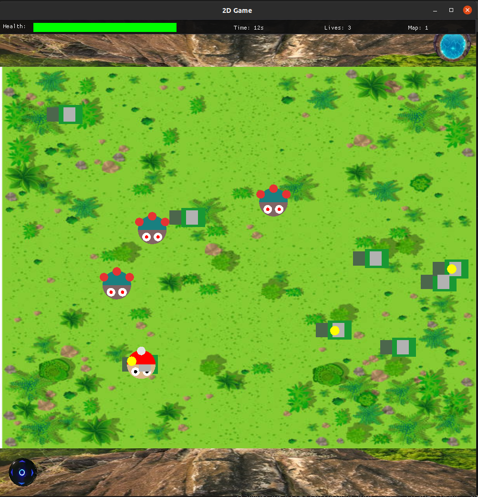
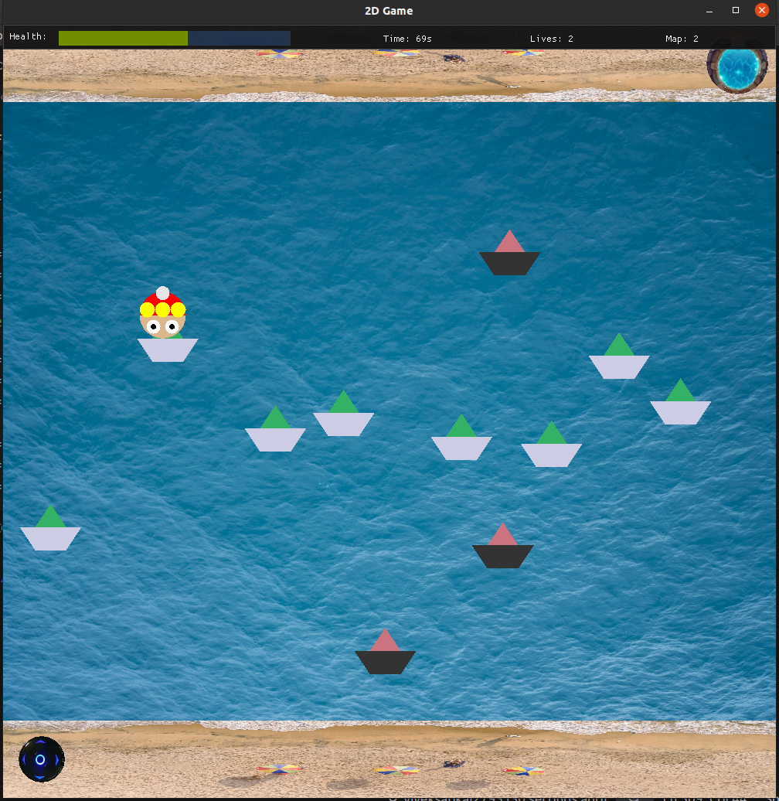
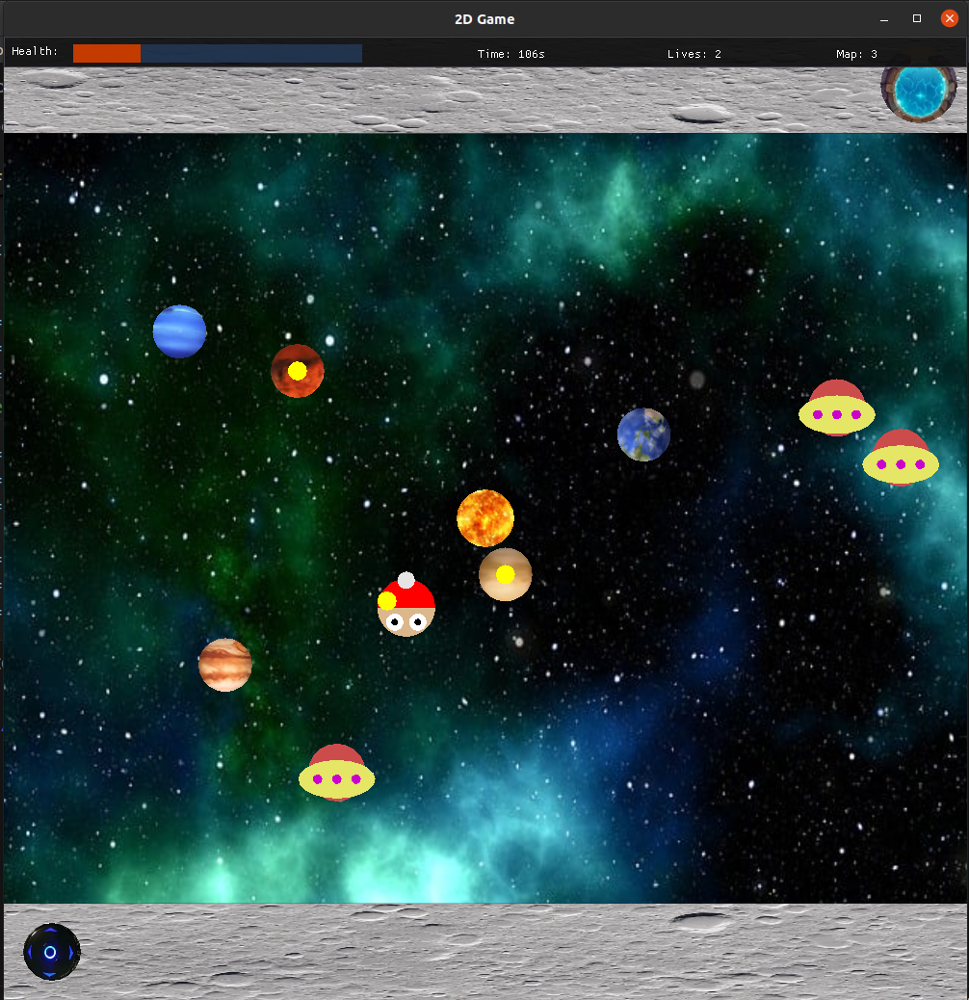

# **2D-Game**

A 2-dimensional game built using PyOpenGL only, including three levels and corresponding three maps with a single player and multiple adversaries.

### **Table of Contents**
- Introduction
- Features
- Requirements
- Setup
- Running the Game
- Game Controls
- Game Mechanics
- Saving and Loading
- Credits
- Screenshots and Texture Info

#### **Introduction**
This is a 2D game where the player navigates through three different maps: Jungle, Beach, and Space. The player must collect keys and avoid enemies to progress through the levels.

#### **Features**
- Three unique maps: Jungle, Beach, and Space.

- Collect keys to unlock the exit door and progress to the next map.
- Avoid enemies to maintain health and lives.
- Save and load game progress.

#### **Requirements**
To run this game, you need the following modules and libraries:
```
Python 3.8 or higher
PyOpenGL
GLFW
ImGui
NumPy
Pillow
```
#### **Setup**

- Clone the repository or download the zip file:
```
git clone https://github.com/yourusername/2D-Game.git
cd 2D-Game
```

- Install the required modules:
```
pip install PyOpenGL PyOpenGL_accelerate glfw imgui numpy pillow
```

- Ensure you have the required assets:

The assets folder should contain images for objects and shaders.
The save_game.json file should be present for saving and loading game progress.

#### **Running the Game**

1. Navigate to the project directory:
```
cd /path/to/2D-Game
```
Replace /path/to/ with your respective path

2. Run the game:
```
python3 main.py
```

#### **Game Controls**

- W: Move up
- A: Move left
- S: Move down
- D: Move right
- SPACE: Jump

#### **Game Mechanics**

- Health: The player has a health bar that decreases when in contact with enemies.
- Lives: The player has a limited number of lives. Losing all lives results in a game over.
- Keys: Collect keys to unlock the exit door and progress to the next map.
- Maps: The game consists of three maps: Jungle, Beach, and Space. Each map has unique challenges and enemies.

#### **Saving and Loading**
- Save Game: The game automatically saves progress when exiting.
- Load Game: You can load the saved game from the main menu.

#### **Credits**
- Developed by **Vivek Sapkal (B22AI066)**
- Special thanks to the open-source community for providing the necessary libraries and tools.

#### **Screenshots and Texture Info**
- For graphical beautification background images are used as textures for map backgrounds; all other graphical elements are created from scratch. In the space map, planet images are used on moving platforms for graphical aesthetics.
- The screenshots folder contains the screenshots of all three maps as well as main menu screen, game over screen and you won screen.
- Following are the screenshots of the maps: 




Enjoy the game!
